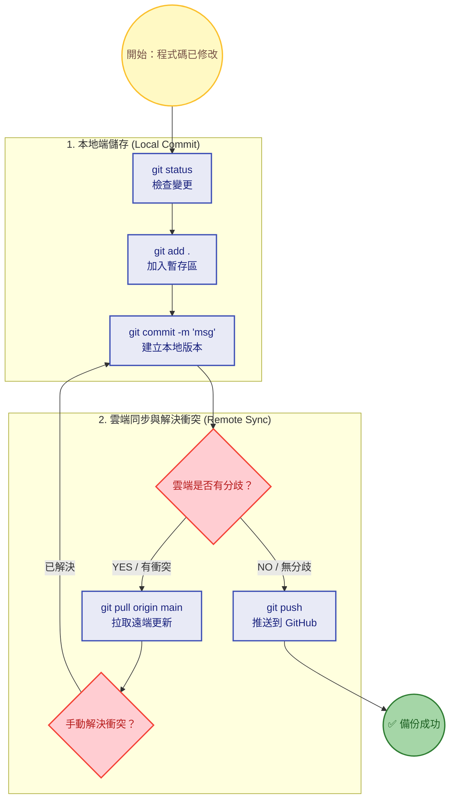

# 程式碼版本維護 SOP (Pure Git Workflow)

---

### 📋 最終指令參考表 (Git Command Reference)

| 目的 (Purpose) | 終端機指令 (Terminal Command) | 備註 (Note) |
| :--- | :--- | :--- |
| **檢查狀態** | `git status` | 查看哪些檔案已修改但尚未提交。 |
| **暫存變更** | `git add .` | 將所有變更的檔案加入等待提交區。 |
| **提交歷史** | `git commit -m "Add new feature logic"` | 儲存一個不可變的本地版本。 |
| **拉取同步** | `git pull origin main` | **在 Push 失敗時使用**，先下載雲端更新，並解決衝突。 |
| **推送雲端** | `git push` | 將本地提交的進度推送到 GitHub。 |
| **強制推送** | `git push -f origin main` | **危險！** 當你的本地端確定是正確的，用來覆蓋 GitHub 上錯誤或混亂的歷史紀錄。 |

這份文件是你日常 Pure Git Workflow 的標準流程：先本地 commit，再視情況 pull 解決衝突，最後 push 備份到雲端。