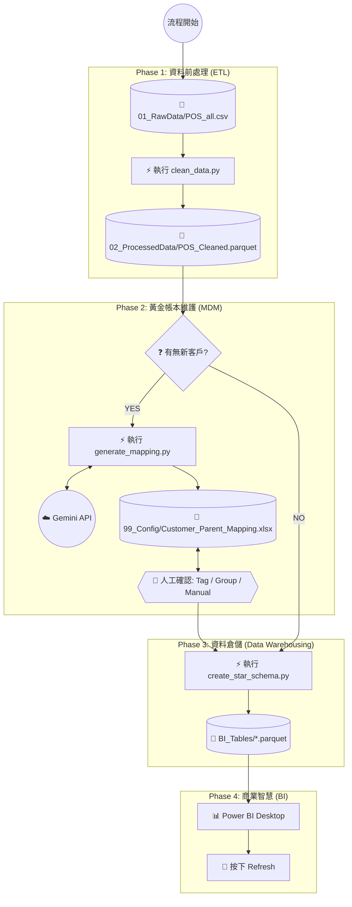

# eCCP 數據驅動業務系統標準流程圖

```mermaid
graph TD
    Start((流程開始)) --> InputData

    subgraph "Phase 1: 資料前處理 (ETL)"
        InputData[("📂 01_RawData/POS_all.csv")] --> CleanScript["⚡️ 執行 clean_data.py"]
        CleanScript --> CleanedData[("📂 02_ProcessedData/POS_Cleaned.parquet")]
    end

    CleanedData --> Decision{"❓ 有無新客戶?"}

    subgraph "Phase 2: 黃金帳本維護 (MDM)"
        Decision -- YES --> MapScript["⚡️ 執行 generate_mapping.py"]
        MapScript <--> Gemini(("☁️ Gemini API"))
        MapScript --> ExcelDB[("📂 99_Config/Customer_Parent_Mapping.xlsx")]
        ExcelDB <--> HumanTask{{"👤 人工確認: Tag / Group / Manual"}}
    end

    Decision -- NO --> SchemaScript
    HumanTask --> SchemaScript

    subgraph "Phase 3: 資料倉儲 (Data Warehousing)"
        SchemaScript["⚡️ 執行 create_star_schema.py"] --> BITables[("📂 BI_Tables/*.parquet")]
    end

    subgraph "Phase 4: 商業智慧 (BI)"
        BITables --> PowerBI["📊 Power BI Desktop"]
        PowerBI --> Refresh["🔄 按下 Refresh"]
    end
```